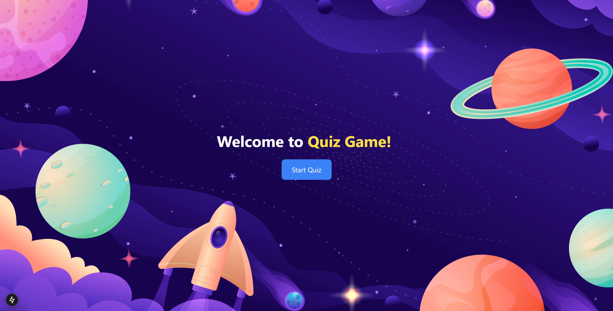
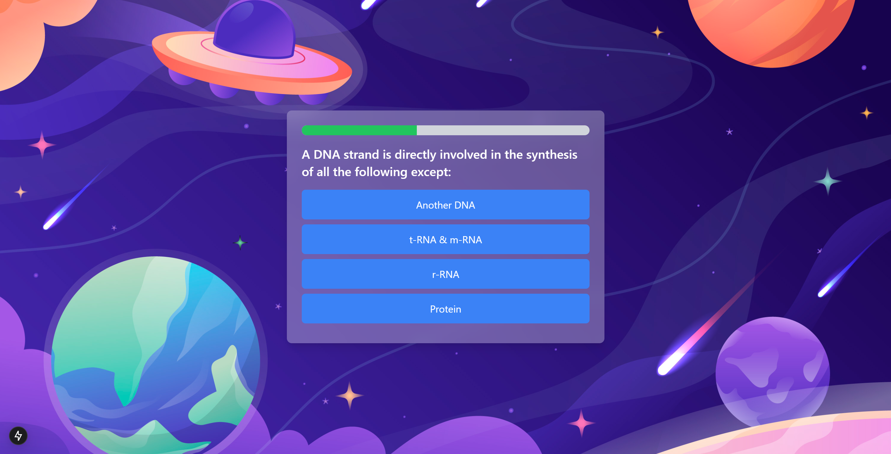
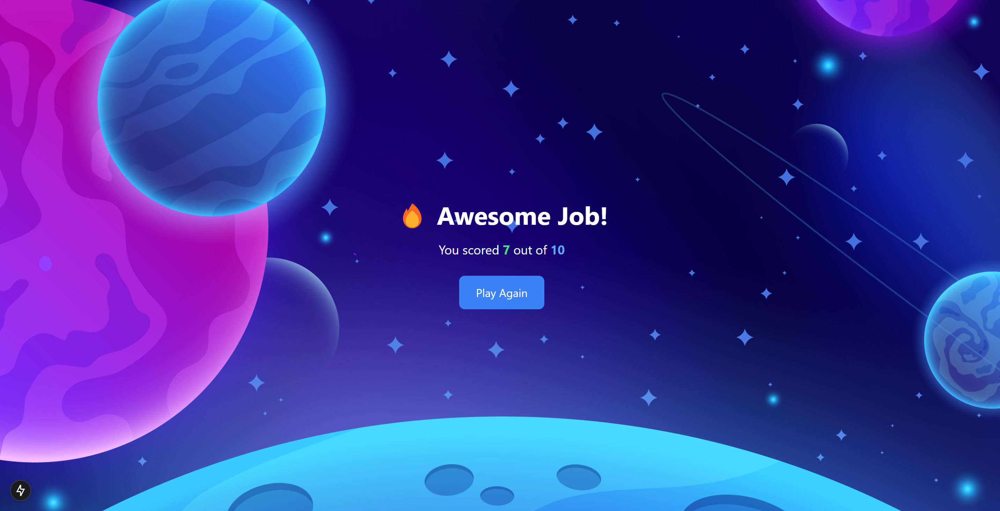

This is a [Next.js](https://nextjs.org) project bootstrapped with [`create-next-app`](https://github.com/vercel/next.js/tree/canary/packages/create-next-app).

# QuizApp

## Project Overview

**QuizApp** is an interactive and engaging web application designed to make taking quizzes fun and easy. With a sleek and responsive user interface, it provides an optimal experience across all devices—desktop, tablet, and mobile. Users can take quizzes, track their scores in real-time, and enjoy an intuitive quiz-taking process.

### Key Features:
- **Real-Time Scoring**: Get instant feedback on your answers.
- **Responsive Design**: Seamless user experience across all screen sizes.
- **User-Friendly Interface**: Easy navigation and visually appealing layout.

## UI Overview:
  
_Screenshot showing the QuizApp homepage_

  
_Screenshot of the quiz page, where users interact with quiz questions_

  
_Screenshot of the quiz page, where score show_

  
_Screenshot of the quiz page, where score show_


## Getting Started

First, run the development server:

```bash
npm run dev
# or
yarn dev
# or
pnpm dev
# or
bun dev
```

Open [http://localhost:3000](http://localhost:3000) with your browser to see the result.

You can start editing the page by modifying `app/page.js`. The page auto-updates as you edit the file.

This project uses [`next/font`](https://nextjs.org/docs/app/building-your-application/optimizing/fonts) to automatically optimize and load [Geist](https://vercel.com/font), a new font family for Vercel.

## Learn More

To learn more about Next.js, take a look at the following resources:

- [Next.js Documentation](https://nextjs.org/docs) - learn about Next.js features and API.
- [Learn Next.js](https://nextjs.org/learn) - an interactive Next.js tutorial.

You can check out [the Next.js GitHub repository](https://github.com/vercel/next.js) - your feedback and contributions are welcome!

## Deploy on Vercel

The easiest way to deploy your Next.js app is to use the [Vercel Platform](https://vercel.com/new?utm_medium=default-template&filter=next.js&utm_source=create-next-app&utm_campaign=create-next-app-readme) from the creators of Next.js.

Check out our [Next.js deployment documentation](https://nextjs.org/docs/app/building-your-application/deploying) for more details.
